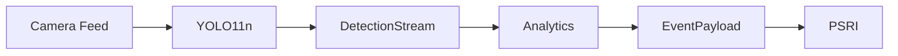

# CityShield AI

CityShield AI is a Real-Time Public Safety Intelligence Platform designed to analyze CCTV feeds and identify urban hazards at the edge.

## Repository Structure

- `ml_engine/`: Unified YOLO11n training and model deployment.
- `analytics/`: Hazard specific heuristic logic.
- `core/`: Shared ByteTrack implementation and JSON schemas.
- `platform/`: (Post-MVP Expansion Area) FastAPI Backend, Next.js Dashboard.

## Architecture Flow



## MVP Scope

Current MVP focuses only on:

- Fire Detection
- Smoke Detection
- Streetlight Detection
- Analytics Layer (Heuristic rules acting on raw bounding boxes)

**CITYSHIELD_V1 (Current MVP trained classes):**

- `fire`
- `smoke`
- `streetlight_normal`
- `streetlight_damaged`

**CITYSHIELD_V2 (Planned Extension classes):**

- `fallen_tree`
- `collapsed_structure`
- `debris`

**COCO fallback classes (Pretrained):**

- `person`
- `vehicle`
- `animal`

The following remain Post-MVP:

- Dashboard
- Database Persistence
- Authentication
- Multi-city deployment
- WebSocket scaling

## Workstream Ownership

- **Lead Architect:** Core, ML Engine, Fire Analytics
- **Workstream A:** Streetlight Intelligence
- **Workstream B:** Animal Intelligence
- **Workstream C:** Accident Intelligence
- **Workstream D:** Collapse Intelligence

## 🚀 Developer Setup Guide

To ensure everyone is on the exact same environment and workflow, follow these steps immediately after cloning the repository:

### 1. Environment Setup

Create and activate an isolated Python environment to avoid dependency conflicts:

**Windows:**

```powershell
python -m venv venv
.\venv\Scripts\activate
```

**Mac/Linux:**

```bash
python3 -m venv venv
source venv/bin/activate
```

### 2. Install Dependencies

Install the CUDA-accelerated version of PyTorch first to ensure the YOLO engine utilizes your graphics card instead of your CPU.

**Install PyTorch with CUDA 12.4:**

```bash
pip install torch torchvision torchaudio --index-url https://download.pytorch.org/whl/cu124
```

Then, install the rest of the repository requirements:

```bash
pip install -r requirements.txt
```

### 3. Verify Your Environment

Run the test suite to ensure your local environment is correctly configured and can discover the `tests/` directory:

```bash
pytest
```

_(You should see 5 passing stub tests)._

### 4. Read Your Assignment

Do not start coding blindly. Open `docs/TEAM_TASK_INSTRUCTIONS.md` and read the strict, step-by-step implementation instructions assigned to your specific Workstream.

### 5. Branching Strategy

Never commit directly to `main`. Always create a branch for your workstream before writing code:

```bash
git checkout -b feature/workstream-X-feature-name
```
