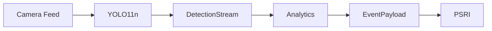

# CityShield AI

CityShield AI is a Real-Time Public Safety Intelligence Platform designed to analyze CCTV feeds and identify urban hazards at the edge.

## Repository Structure
*   `ml_engine/`: Unified YOLO11n training and model deployment.
*   `analytics/`: Hazard specific heuristic logic.
*   `core/`: Shared ByteTrack implementation and JSON schemas.
*   `platform/`: (Post-MVP Expansion Area) FastAPI Backend, Next.js Dashboard.

## Architecture Flow

## MVP Scope

Current MVP focuses only on:
*   Fire Detection
*   Smoke Detection
*   Streetlight Detection
*   Analytics Layer (Heuristic rules acting on raw bounding boxes)

**CITYSHIELD_V1 (Current MVP trained classes):**
*   `fire`
*   `smoke`
*   `streetlight_normal`
*   `streetlight_damaged`

**CITYSHIELD_V2 (Planned Extension classes):**
*   `fallen_tree`
*   `collapsed_structure`
*   `debris`

**COCO fallback classes (Pretrained):**
*   `person`
*   `vehicle`
*   `animal`

The following remain Post-MVP:
*   Dashboard
*   Database Persistence
*   Authentication
*   Multi-city deployment
*   WebSocket scaling

## Workstream Ownership
*   **Lead Architect:** Core, ML Engine, Fire Analytics
*   **Workstream A:** Streetlight Intelligence
*   **Workstream B:** Animal Intelligence
*   **Workstream C:** Accident Intelligence
*   **Workstream D:** Collapse Intelligence

## Quick-Start Setup
1. Review `docs/1_PRODUCT_AND_TEAM.md` and `docs/TEAM_OPERATIONS.md` for branch/PR strategy and ownership.
2. Review `docs/2_ARCHITECTURE_AND_DESIGN.md` to understand the data flow.
3. Check `docs/INTEGRATION_GUIDE.md` for integration specifications.
4. Set up your Python environment using `requirements.txt` (Warning: Windows users manually install PyTorch cu124).
